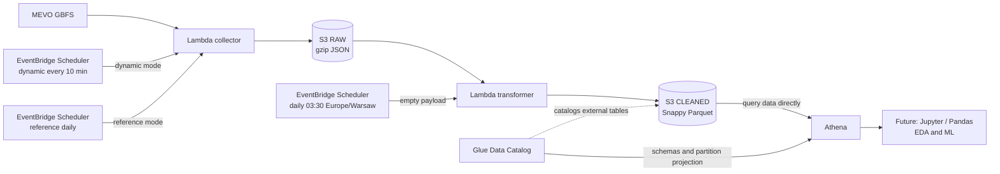

# MEVO Urban Mobility Analytics & Forecasting

MEVO Urban Mobility Analytics & Forecasting is a portfolio-oriented data engineering and future machine learning project built around public GBFS data from the MEVO metropolitan bike-sharing system in Poland. It turns frequent availability snapshots into a reproducible, queryable history while preserving the source payloads needed to rebuild the analytical layer.

The ingestion and cleaned-data pipelines are deployed on AWS. Exploratory analysis, feature engineering, weather enrichment, forecasting, and rebalancing recommendations are the next stages.

## What is this?

Bike-sharing availability changes continuously across stations, vehicle types, and time of day. This project collects those changes so they can be studied historically instead of only observed in the live API.

The current system provides the data foundation:

- GBFS feed discovery and scheduled collection;
- immutable-by-application-contract RAW snapshots;
- daily validation and normalization for the previous Warsaw calendar day;
- compact Parquet datasets queryable through Athena;
- explicit time and schema contracts suitable for later analytics and ML.

Availability snapshots do not directly represent trips. Inferring station flows and producing forecasts are deliberately later analytical steps.

## Architecture



RAW and CLEANED are logical S3 layers addressed through the same bucket configuration in the current code. Glue stores table metadata; the analytical data remains in S3 and Athena reads it there.

See [Architecture Notes](docs/architecture.md) for the design rationale and operational boundaries.

## Current Status

| Phase | Status | Delivered |
|---|---|---|
| Sprint 0 — ingestion | Complete | Dynamic and reference GBFS collection, gzip RAW storage, Lambda deployment, and schedules |
| Sprint 1 — analytical layer | Functionally complete | DST-aware daily transformation, cleaned Parquet, Glue external tables, Athena queries, and a verified fact/dimension join |
| Sprint 2 — analysis | Next | Exploratory analysis and feature engineering |

The transformer deployment and its `03:30 Europe/Warsaw` schedule are configured. A real run for an explicitly selected local date has been verified; this documentation pass did not independently confirm the first unattended scheduler-triggered execution, so that remains an operational check rather than a claimed result.

## Data Pipeline

### RAW: preserved source snapshots

The collector first reads the GBFS discovery document instead of hard-coding individual feed URLs. It assigns one UTC `collected_at` value to all feeds in an invocation, validates the HTTP/JSON and feed structure, compresses the original response bytes, and writes timestamped objects to S3.

| Collection mode | Feeds | Schedule |
|---|---|---|
| `dynamic` | `station_status`, `free_bike_status` | Every 10 minutes |
| `reference` | `station_information`, `vehicle_types` | Daily |

Expected API or feed-validation failures are isolated by feed. Successful feeds are retained during a partial failure, while a total feed failure writes nothing and causes the invocation to fail.

```text
raw/{feed}/year=YYYY/month=MM/day=DD/<UTC-timestamp>.json.gz
```

RAW objects are append-only by the application's naming and write contract and serve as the rebuildable source of truth. The repository does not assume that S3 Object Lock is enabled.

### CLEANED: daily analytical datasets

At `03:30 Europe/Warsaw`, the transformer receives `{}` and automatically selects the previous Warsaw calendar day. It reads every relevant UTC RAW partition, validates and normalizes the supported feeds, then writes one compact file per dataset:

```text
cleaned/fact_station_status/year=YYYY/month=MM/day=DD/part-000.parquet
cleaned/dim_station/year=YYYY/month=MM/day=DD/part-000.parquet
```

The files use explicit PyArrow schemas, Snappy compression, and millisecond-precision UTC timestamps. Re-running a local date deterministically replaces its derived `part-000.parquet`; the RAW inputs remain available for another rebuild.

`free_bike_status` and `vehicle_types` are preserved in RAW but are not yet part of the cleaned fact/dimension layer.

## Data Model

| Dataset | Grain | Columns |
|---|---|---|
| `fact_station_status` | One station in one dynamic snapshot | `snapshot_ts`, `feed_last_updated`, `station_id`, `last_reported`, `is_installed`, `is_renting`, `is_returning`, `bikes_available`, `classic_bikes_available`, `ebikes_available`, `docks_available` |
| `dim_station` | One station in one reference snapshot | `snapshot_ts`, `feed_last_updated`, `station_id`, `station_name`, `address`, `cross_street`, `latitude`, `longitude`, `capacity`, `is_virtual_station` |

An Athena query has verified the fact/dimension join on `station_id` plus matching `year`, `month`, and `day` partition values. The reference schedule normally supplies one dimension snapshot per local day. If a day contains multiple reference snapshots, an analytical query should choose the intended `snapshot_ts` before treating the relationship as many-to-one.

## Time Handling

| Contract | Time basis |
|---|---|
| RAW partition path and object timestamp | UTC collection time |
| CLEANED partition path | `Europe/Warsaw` calendar date |
| `snapshot_ts` and other Parquet timestamps | UTC, stored at millisecond precision |
| Automatic batch selection | Previous `Europe/Warsaw` calendar day |

The transformer uses `ZoneInfo("Europe/Warsaw")`; it never substitutes a fixed UTC+1 or UTC+2 offset. Each local midnight is converted independently, so daylight-saving transitions naturally produce 23- or 25-hour UTC windows. A Warsaw local day can therefore span two UTC RAW partition dates.

## Athena / Analytical Layer

- S3 remains the storage and data layer.
- Glue Data Catalog holds explicit external-table schemas and S3 locations.
- Athena queries `fact_station_status` and `dim_station` directly as Parquet.
- Partition projection derives date partitions without manually registering each day.
- Millisecond timestamp precision keeps the files compatible with Athena Engine v3.

The deployed Glue and Athena configuration is an operational resource; this repository currently contains the producer code and data contracts, not infrastructure-as-code or tracked DDL.

## Validation Example

A real transformer Lambda execution for local date `2026-08-16` produced:

| Dataset | Input snapshots | Output rows |
|---|---:|---:|
| `fact_station_status` | 143 | 120,406 |
| `dim_station` | 1 | 842 |

Earlier validation found no duplicate `(snapshot_ts, station_id)` fact keys and successfully queried a partition-aligned fact/dimension join. The Lambda completed in approximately 10 seconds with 1,024 MB configured and about 353 MB peak memory. These figures describe one validation run, not permanent volume or performance guarantees.

## Repository Structure

```text
.
├── README.md
├── pyproject.toml
├── .gitignore
├── docs/
│   ├── architecture.md
│   └── gbfs_reconnaissance.md
├── scripts/
│   ├── build_lambda.ps1
│   └── build_transformer_lambda.ps1
├── src/
│   ├── mevo_collector/
│   └── mevo_transformer/
└── tests/
```

`tests/` contains unit coverage for collection, transformation, storage, time handling, and both Lambda entry points.

## Local Development

The installable package supports Python 3.12 or newer. The deployed transformer and its dependency layer specifically target Python 3.14 on x86_64 AWS Lambda.

PowerShell environment setup:

```powershell
python -m venv .venv
.\.venv\Scripts\Activate.ps1
python -m pip install --upgrade pip
python -m pip install -e .
```

The editable install and test commands are otherwise platform-independent:

```text
python -m pip install -e .
python -m unittest discover -s tests -v
```

Tests use mocked AWS clients and do not require cloud credentials. Any local AWS verification or deployment work should use a least-privilege IAM profile—never root credentials—and no credentials should be committed.

## Deployment Artifacts

```powershell
.\scripts\build_lambda.ps1
.\scripts\build_transformer_lambda.ps1
```

| Script | Output |
|---|---|
| `build_lambda.ps1` | Collector deployment ZIP |
| `build_transformer_lambda.ps1` | Transformer code ZIP plus a separate dependency Lambda Layer ZIP |

The transformer build targets CPython 3.14/Linux x86_64, pins PyArrow `25.0.1` and tzdata `2026.3`, creates deterministically ordered archives, verifies dependency metadata, and checks Lambda's unpacked-size limit. Generated `build/`, `dist/`, and ZIP artifacts are ignored by Git. The scripts package code only; they do not create or update AWS infrastructure.

## Engineering Decisions

| Choice | Rationale |
|---|---|
| GBFS auto-discovery | Follows the publisher's current feed URLs instead of duplicating them in code |
| RAW before transformation | Preserves evidence, supports reprocessing, and separates ingestion from evolving analytical assumptions |
| Daily local-day batches | Matches how mobility patterns are interpreted while retaining UTC event timestamps |
| Parquet with explicit schemas | Reduces scan volume and prevents accidental schema drift in Athena |
| S3 + Lambda + EventBridge | Fits the current volume with low operational overhead and no continuously running compute |
| Glue + partition projection | Makes date-partitioned S3 files queryable without a partition-registration job |

Spark, Airflow, Redshift, and relational databases are intentionally deferred until workload scale or orchestration complexity justifies them.

## Roadmap

1. **Sprint 0 — ingestion:** complete
2. **Sprint 1 — cleaned analytical layer:** complete
3. **Sprint 2 — EDA and feature engineering:** next
4. **Sprint 3 — historical weather integration and statistical analysis**
5. **Sprint 4 — station profiles and inferred/net-flow analytics**
6. **Sprint 5 — availability forecasting**
7. **Sprint 6 — rebalancing recommendations**
8. **Later, if useful:** a compact dashboard and optional educational Airflow/Spark modules

## Further Documentation

- [Architecture Notes](docs/architecture.md) — current components, contracts, trade-offs, and deferred technologies.
- [GBFS Reconnaissance](docs/gbfs_reconnaissance.md) — point-in-time source exploration used to shape the collector.
