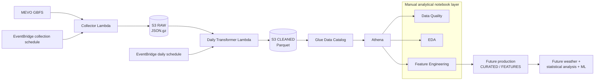

# MEVO Urban Mobility Analytics & Forecasting

MEVO is an end-to-end AWS data engineering and analytics project built on public GBFS bike-sharing data. The system continuously collects station snapshots, preserves RAW history, transforms it into query-efficient Parquet, exposes the analytical layer through Glue/Athena, and uses Jupyter notebooks for Data Quality, EDA, and Feature Engineering that prepare the data for future forecasting.

Forecasting is not implemented yet. The next production step is to move the accepted feature contract from the analytical notebook into a CURATED / FEATURES layer.

## Pipeline at a glance


```mermaid
flowchart LR
    GBFS[MEVO GBFS]
    COLLECT_SCHEDULE[EventBridge collection schedule]
    TRANSFORM_SCHEDULE[EventBridge daily schedule]
    COLLECTOR[Collector Lambda]
    RAW[(S3 RAW<br/>JSON.gz)]
    TRANSFORMER[Daily Transformer Lambda]
    CLEANED[(S3 CLEANED<br/>Parquet)]
    GLUE[Glue Data Catalog]
    ATHENA[Athena]

    subgraph NOTEBOOKS[Manual analytical notebook layer]
        DQ[Data Quality]
        EDA[EDA]
        FE[Feature Engineering]
    end

    FEATURES[Future production<br/>CURATED / FEATURES]
    ML[Future weather +<br/>statistical analysis + ML]

    GBFS --> COLLECTOR
    COLLECT_SCHEDULE --> COLLECTOR
    COLLECTOR --> RAW
    RAW --> TRANSFORMER
    TRANSFORM_SCHEDULE --> TRANSFORMER
    TRANSFORMER --> CLEANED
    CLEANED --> GLUE
    GLUE --> ATHENA
    ATHENA --> DQ
    ATHENA --> EDA
    ATHENA --> FE
    FE --> FEATURES
    FEATURES --> ML
```

The collection and transformation path runs autonomously on AWS. The analytical notebooks are read-only consumers of Athena results and are currently run manually. Notebook outputs are intentionally committed so the completed analysis is visible without AWS credentials.

RAW and CLEANED are logical S3 layers addressed through the same bucket configuration in the current code. Glue stores table metadata; the analytical data remains in S3 and Athena reads it there. See [Architecture Notes](docs/architecture.md) for the design rationale and operational boundaries.

## Current Status

| Phase | Status | Delivered |
|---|---|---|
| Sprint 0 - Ingestion | ✅ Complete | Dynamic and reference GBFS collection, gzip RAW storage, Lambda deployment, and schedules |
| Sprint 1 - Analytical layer | ✅ Complete | DST-aware daily transformation, CLEANED Parquet, Glue external tables, Athena queries, and a verified fact/dimension join |
| Sprint 2 - Data Quality, EDA & Feature Engineering | ✅ Complete | Three committed analytical notebooks with saved outputs, quality checks, descriptive analysis, and a leakage-aware feature contract |
| Sprint 3 - Production Feature Layer / ML-ready dataset | ➡️ Next | Move accepted feature logic into production, write S3 CURATED / FEATURES Parquet, expose the feature table through Athena, and add a validation contract |

The transformer deployment and its `03:30 Europe/Warsaw` schedule are configured. A real run for an explicitly selected local date has been verified; this documentation pass did not independently confirm the first unattended scheduler-triggered execution, so that remains an operational check rather than a claimed result.

## Analytical notebooks

| Notebook | Purpose | Highlights |
|---|---|---|
| [01 - Data Quality & Baseline](notebooks/01_data_quality_and_baseline.ipynb) | Validate the analytical dataset before interpretation | Temporal coverage and cadence, duplicate / NULL / logic checks, scheduler-aware freshness, and a dataset health baseline |
| [02 - Exploratory Data Analysis](notebooks/02_eda.ipynb) | Describe system, time, station, and spatial patterns | Temporal profiles, station rankings, empty/full behavior, e-bike composition, geospatial maps, and station-level availability |
| [03 - Feature Engineering](notebooks/03_feature_engineering.ipynb) | Define forecasting-ready station features | Cadence-safe deltas, net flow/activity proxies, validated 10/20/30-minute lags, rolling 30/60-minute features, heatmaps, and a leakage-aware feature contract |

All three notebooks contain saved outputs. They are committed deliberately so a reviewer can inspect the analysis without an AWS account or a live Athena session.

## Current analytical highlights

The following figures come from the committed notebook outputs, not from a new query or notebook execution:

- The Data Quality baseline reports approximately **99.84% temporal coverage** across 1,277 observed fact snapshots.
- The analytical datasets contain **0 duplicate fact keys**, **0 critical NULLs**, and **0 invalid logical or range values** in the checks performed.
- The Feature Engineering baseline contains approximately **1.44 million feature rows**; valid transition/delta availability is **99.82%**, with valid 10/20/30-minute lags of approximately **99.82% / 99.71% / 99.59%**.
- Valid rolling-history availability is approximately **99.59% for 30 minutes** and **99.24% for 60 minutes**.
- Available-bike composition is approximately **71.56% e-bikes** in the EDA extract.
- Mean activity proxy is strongest around **16:00**, and **SOP008** is the most active station in the selected Feature Engineering ranking.

These patterns are preliminary because the retained history is still short and continues to grow. Net-flow and activity metrics are proxies based on inventory changes, not ground-truth trip, pickup, or return counts.

## Completed Sprint 2 analytical layer

### Data Quality

The Data Quality notebook checks the assumptions required by downstream analysis:

- approximately 10-minute cadence, with a configured 7-13 minute tolerance band;
- temporal coverage and estimated missing snapshots;
- duplicate keys at the declared `(snapshot_ts, station_id)` grain;
- NULLs, with critical fields separated from optional descriptive fields;
- logical and range validation for counters, booleans, coordinates, and vehicle totals;
- scheduler-aware freshness against the latest local day expected from the daily CLEANED job.

### Exploratory Data Analysis

The EDA notebook examines hour, weekday, and weekend profiles; station-level availability; empty and full states; classic-bike versus e-bike composition; station rankings; and geospatial maps. Availability is an inventory-state measure, not a direct measure of demand or utilization. Empty/full observations can also reflect rebalancing, service operations, or station configuration.

### Feature Engineering

The feature notebook defines a station-level, leakage-aware contract from CLEANED data:

- `delta_bikes = current_bikes - previous_bikes` and corresponding classic/e-bike deltas;
- deltas are emitted only for cadence-valid transitions;
- `net_inflow_proxy`, `net_outflow_proxy`, and `activity_proxy` derived from inventory changes;
- validated 10-, 20-, and 30-minute lags based on actual elapsed time;
- rolling 30- and 60-minute availability and activity features;
- local-time, weekday, weekend, and cyclical hour/day encodings.

Delta, flow, and activity fields are **net inventory-flow proxies**, not exact rides, pickups, returns, or ground-truth demand. The accepted contract is intended to move into the production feature layer in Sprint 3.

## What is this?

Bike-sharing availability changes continuously across stations, vehicle types, and time of day. This project captures those changes so they can be studied historically instead of only observed in the live API.

The current system provides the data foundation:

- GBFS feed discovery and scheduled collection;
- immutable-by-application-contract RAW snapshots;
- daily validation and normalization for the previous Warsaw calendar day;
- compact Parquet datasets queryable through Athena;
- committed Data Quality, EDA, and Feature Engineering analysis;
- explicit time and schema contracts suitable for the next production feature layer.

Availability snapshots do not directly represent trips. Forecasting, historical weather enrichment, and rebalancing recommendations remain future work.

## Data Pipeline

### RAW: preserved source snapshots

The collector first reads the GBFS discovery document instead of hard-coding individual feed URLs. It assigns one UTC `collected_at` value to all feeds in an invocation, validates the HTTP/JSON and feed structure, compresses the original response bytes, and writes timestamped objects to S3.

| Collection mode | Feeds | Schedule |
|---|---|---|
| `dynamic` | `station_status`, `free_bike_status` | Every 10 minutes |
| `reference` | `station_information`, `vehicle_types` | Daily |

Expected API or feed-validation failures are isolated by feed. Successful feeds are retained during a partial failure, while a total feed failure writes nothing and causes the invocation to fail.

```text
raw/{feed}/year=YYYY/month=MM/day=DD/<UTC-timestamp>.json.gz
```

RAW objects are append-only by the application's naming and write contract and serve as the rebuildable source of truth. The repository does not assume that S3 Object Lock is enabled.

### CLEANED: daily analytical datasets

At `03:30 Europe/Warsaw`, the transformer receives `{}` and automatically selects the previous Warsaw calendar day. It reads every relevant UTC RAW partition, validates and normalizes the supported feeds, then writes one compact file per dataset:

```text
cleaned/fact_station_status/year=YYYY/month=MM/day=DD/part-000.parquet
cleaned/dim_station/year=YYYY/month=MM/day=DD/part-000.parquet
```

The files use explicit PyArrow schemas, Snappy compression, and millisecond-precision UTC timestamps. Re-running a local date deterministically replaces its derived `part-000.parquet`; the RAW inputs remain available for another rebuild.

`free_bike_status` and `vehicle_types` are preserved in RAW but are not yet part of the cleaned fact/dimension layer.

## Data Model

| Dataset | Grain | Columns |
|---|---|---|
| `fact_station_status` | One station in one dynamic snapshot | `snapshot_ts`, `feed_last_updated`, `station_id`, `last_reported`, `is_installed`, `is_renting`, `is_returning`, `bikes_available`, `classic_bikes_available`, `ebikes_available`, `docks_available` |
| `dim_station` | One station in one reference snapshot | `snapshot_ts`, `feed_last_updated`, `station_id`, `station_name`, `address`, `cross_street`, `latitude`, `longitude`, `capacity`, `is_virtual_station` |

An Athena query has verified the fact/dimension join on `station_id` plus matching `year`, `month`, and `day` partition values. The reference schedule normally supplies one dimension snapshot per local day. If a day contains multiple reference snapshots, an analytical query should choose the intended `snapshot_ts` before treating the relationship as many-to-one.

## Time Handling

| Contract | Time basis |
|---|---|
| RAW partition path and object timestamp | UTC collection time |
| CLEANED partition path | `Europe/Warsaw` calendar date |
| `snapshot_ts` and other Parquet timestamps | UTC, stored at millisecond precision |
| Automatic batch selection | Previous `Europe/Warsaw` calendar day |

The transformer uses `ZoneInfo("Europe/Warsaw")`; it never substitutes a fixed UTC+1 or UTC+2 offset. Each local midnight is converted independently, so daylight-saving transitions naturally produce 23- or 25-hour UTC windows. A Warsaw local day can therefore span two UTC RAW partition dates.

## Athena / Analytical Layer

- S3 remains the storage and data layer.
- Glue Data Catalog holds explicit external-table schemas and S3 locations.
- Athena queries `fact_station_status` and `dim_station` directly as Parquet.
- Partition projection derives date partitions without manually registering each day.
- Millisecond timestamp precision keeps the files compatible with Athena Engine v3.
- Athena performs server-side scans, aggregations, joins, and window functions; Pandas receives compact analytical results rather than the full fact table.
- The notebooks are read-only with respect to AWS and do not publish production data.

The deployed Glue and Athena configuration is an operational resource; this repository currently contains the producer code and data contracts, not infrastructure-as-code or tracked DDL.

## Validation Example

A real transformer Lambda execution for local date `2026-08-16` produced:

| Dataset | Input snapshots | Output rows |
|---|---:|---:|
| `fact_station_status` | 143 | 120,406 |
| `dim_station` | 1 | 842 |

Earlier validation found no duplicate `(snapshot_ts, station_id)` fact keys and successfully queried a partition-aligned fact/dimension join. The Lambda completed in approximately 10 seconds with 1,024 MB configured and about 353 MB peak memory. These figures describe one validation run, not permanent volume or performance guarantees.

## Repository Structure

```text
.
├── README.md
├── pyproject.toml
├── .gitignore
├── docs/
│   ├── architecture.md
│   └── gbfs_reconnaissance.md
├── notebooks/
│   ├── 01_data_quality_and_baseline.ipynb
│   ├── 02_eda.ipynb
│   └── 03_feature_engineering.ipynb
├── scripts/
│   ├── build_lambda.ps1
│   └── build_transformer_lambda.ps1
├── src/
│   ├── mevo_collector/
│   └── mevo_transformer/
└── tests/
```

`tests/` contains unit coverage for collection, transformation, storage, time handling, and both Lambda entry points.

## Local Development

The installable package supports Python 3.12 or newer. The deployed transformer and its dependency layer specifically target Python 3.14 on x86_64 AWS Lambda.

PowerShell environment setup:

```powershell
python -m venv .venv
.\.venv\Scripts\Activate.ps1
python -m pip install --upgrade pip
python -m pip install -e .
```

The editable install and test commands are otherwise platform-independent:

```text
python -m pip install -e .
python -m unittest discover -s tests -v
```

Tests use mocked AWS clients and do not require cloud credentials. Any local AWS verification or deployment work should use a least-privilege IAM profile - never root credentials - and no credentials should be committed.

## Deployment Artifacts

```powershell
.\scripts\build_lambda.ps1
.\scripts\build_transformer_lambda.ps1
```

| Script | Output |
|---|---|
| `build_lambda.ps1` | Collector deployment ZIP |
| `build_transformer_lambda.ps1` | Transformer code ZIP plus a separate dependency Lambda Layer ZIP |

The transformer build targets CPython 3.14/Linux x86_64, pins PyArrow `25.0.1` and tzdata `2026.3`, creates deterministically ordered archives, verifies dependency metadata, and checks Lambda's unpacked-size limit. Generated `build/`, `dist/`, and ZIP artifacts are ignored by Git. The scripts package code only; they do not create or update AWS infrastructure.

## Engineering Decisions

| Choice | Rationale |
|---|---|
| GBFS auto-discovery | Follows the publisher's current feed URLs instead of duplicating them in code |
| RAW before transformation | Preserves evidence, supports reprocessing, and separates ingestion from evolving analytical assumptions |
| Daily local-day batches | Matches how mobility patterns are interpreted while retaining UTC event timestamps |
| Parquet with explicit schemas | Reduces scan volume and prevents accidental schema drift in Athena |
| S3 + Lambda + EventBridge | Fits the current volume with low operational overhead and no continuously running compute |
| Glue + partition projection | Makes date-partitioned S3 files queryable without a partition-registration job |

Spark, Airflow, Redshift, and relational databases are intentionally deferred until workload scale or orchestration complexity justifies them. They are not prerequisites for the current roadmap; any later use can remain educational or follow a measured requirement.

## Roadmap

1. **Sprint 0 - ingestion:** complete
2. **Sprint 1 - RAW -> CLEANED / Athena:** complete
3. **Sprint 2 - Data Quality, EDA & Feature Engineering:** complete
4. **Sprint 3 - Production CURATED / FEATURES layer:** next
5. **Sprint 4 - Historical weather enrichment and statistical analysis**
6. **Sprint 5 - Forecasting baseline / ML**
7. **Sprint 6 - Empty/full risk and rebalancing recommendations**
8. **Later - Compact dashboard / presentation layer**

## Further Documentation

- [Architecture Notes](docs/architecture.md) - current components, contracts, analytical notebook boundary, next production layer, and deferred technologies.
- [GBFS Reconnaissance](docs/gbfs_reconnaissance.md) - point-in-time source exploration used to shape the collector.
