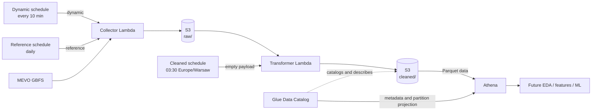

# Architecture Notes

The current architecture covers two completed foundations: scheduled GBFS ingestion and a daily analytical layer. It deliberately separates preserved source snapshots from rebuildable Parquet datasets so future analysis can evolve without recollecting history.

## Current Architecture



The two S3 nodes represent prefixes in the logical data architecture, not a requirement for separate buckets. The current implementation reads and writes both through the same configured bucket.

## Ingestion Layer

The collector begins with the MEVO GBFS discovery document and resolves current feed URLs at runtime. This avoids coupling the application to publisher-managed endpoint URLs.

| Mode | Feeds | Cadence | Purpose |
|---|---|---|---|
| `dynamic` | `station_status`, `free_bike_status` | Every 10 minutes | Capture changing station and free-bike availability |
| `reference` | `station_information`, `vehicle_types` | Daily | Capture station and vehicle-type reference data |

Every invocation uses one UTC `collected_at` across its selected feeds. The client validates HTTP success, JSON structure, and the expected feed collection before a snapshot reaches storage. Expected per-feed API or validation errors are isolated: successful feeds are retained on a partial failure, while a total feed failure stores nothing and fails the invocation. Discovery, unexpected program errors, and S3 errors propagate rather than being hidden.

`system_pricing_plans` was explored during source reconnaissance but is not part of either deployed collection mode.

## RAW Storage Contract

The collector compresses the original response bytes in memory and writes them as gzip JSON:

```text
raw/{feed}/year=YYYY/month=MM/day=DD/<UTC-timestamp>.json.gz
```

Partition values and the filename timestamp are based on the UTC collection time. Metadata records the feed, collection time, and source `last_updated` value when available.

RAW is the replayable source of truth. Timestamped keys and application behavior make it append-only under the current contract; this documentation does not imply that S3 Object Lock, versioning, or another bucket-level immutability control is configured.

## Daily Transformation

EventBridge Scheduler invokes the cleaned transformer daily at `03:30 Europe/Warsaw` with `{}`. The Lambda converts its current UTC time to Warsaw time and selects the previous local calendar date. A validated `local_date` override also supports explicit reruns or backfills.

For each supported cleaned feed, the transformer:

1. computes the local day's half-open UTC interval;
2. lists the one or two UTC RAW partitions touched by that interval;
3. filters snapshots by their timestamped object keys;
4. decompresses and validates every selected snapshot;
5. normalizes records into a stable schema and deterministic order;
6. serializes one Snappy-compressed Parquet file;
7. writes the deterministic local-date output key.

The current cleaned feeds run sequentially: `station_status` first, then `station_information`. Publication is not a transactional two-dataset commit. If the second feed fails after the first was written, rerunning the same local date safely replaces the derived daily objects from preserved RAW data.

## Local-Day and UTC Contract

Time semantics are explicit because a mobility “day” and an object-storage partition do not use the same boundary.

| Item | Contract |
|---|---|
| RAW partition date | UTC date of collection |
| Batch date | `Europe/Warsaw` calendar date |
| Batch window | Half-open interval from local midnight to the next local midnight, converted to UTC |
| CLEANED partition date | Warsaw local calendar date |
| Parquet timestamps | UTC with millisecond precision |

The implementation uses `ZoneInfo("Europe/Warsaw")` and converts both midnight boundaries independently. It does not hard-code UTC+1 or UTC+2, so spring and autumn daylight-saving transitions produce the correct 23- and 25-hour windows. A normal Warsaw day also commonly crosses two UTC partition dates.

`snapshot_ts` comes from the collector timestamp encoded in the RAW object key. Source timestamps such as `feed_last_updated` and `last_reported` remain separate fields. PyArrow writes all analytical timestamps at millisecond precision for Athena Engine v3 compatibility.

## CLEANED Parquet Layer

| Source feed | Dataset | Grain | Output |
|---|---|---|---|
| `station_status` | `fact_station_status` | Station × dynamic snapshot | `cleaned/fact_station_status/year=YYYY/month=MM/day=DD/part-000.parquet` |
| `station_information` | `dim_station` | Station × reference snapshot | `cleaned/dim_station/year=YYYY/month=MM/day=DD/part-000.parquet` |

Schemas are explicit and non-nullable except for the optional `address` and `cross_street` dimension fields. Validation rejects malformed required fields, duplicate station IDs within one source snapshot, invalid coordinates or counters, and inconsistent known vehicle totals. Non-breaking source metadata deviations are retained as warnings rather than silently changing the schema.

`free_bike_status` and `vehicle_types` remain available in RAW but do not yet have cleaned datasets.

## Glue and Athena Serving Layer

The `mevo_analytics` Glue database describes two external tables, `fact_station_status` and `dim_station`. Glue stores schemas, partition-projection properties, and S3 locations; it does not hold the underlying rows. Athena reads the Parquet files directly from S3.

Partition projection calculates `year`, `month`, and `day` locations at query time, avoiding a crawler or daily `ADD PARTITION` operation. A validated query joined the two datasets by `station_id` and matching local-date partition values.

The dimension's actual grain is station × reference snapshot, not an enforced single row per station per day. The deployed daily reference cadence normally yields one snapshot. If more are present, consumers should select the intended `snapshot_ts` before a many-to-one fact/dimension join.

The repository currently contains the producer implementation and Parquet contracts, but no tracked Glue/Athena DDL or infrastructure-as-code. Those AWS resources were configured and verified separately.

## Why This Stack Is Sufficient

- **S3** provides durable, low-cost storage for immutable-style RAW history and compact analytical files.
- **Lambda** fits short collection jobs and a daily transformation that has already completed in roughly 10 seconds at the validated volume.
- **EventBridge Scheduler** expresses three simple time-based triggers without a continuously running orchestrator.
- **Glue and Athena** provide schema-on-read SQL without loading the data into another database.
- **Daily compaction** turns many small snapshots into one scan-efficient object per dataset and local date.

This keeps operational surface area proportional to the project while preserving clear seams for later growth.

## Why Heavier Platforms Are Deferred

| Technology | Why it is not used yet |
|---|---|
| Spark | The current daily volume fits comfortably in one Lambda process; distributed execution would add packaging and operational cost without a measured need |
| Airflow | Three fixed schedules and one linear batch do not yet require a separate workflow platform or metadata database |
| Redshift | Athena already answers analytical SQL directly over compact Parquet, so a provisioned warehouse would duplicate storage and loading work |
| RDS | The pipeline has no transactional application workload or mutable relational state |

These technologies are not rejected permanently. They become reasonable when data volume, dependency graphs, latency, concurrency, or educational goals create a concrete requirement.

## Future Analytical and ML Layer

The next layer remains outside the production data pipeline:

1. exploratory analysis and station/time features;
2. historical weather enrichment;
3. station profiles and inferred net-flow analysis;
4. explainable availability forecasting;
5. rebalancing recommendations;
6. an optional compact presentation layer.

The RAW/CLEANED boundary and explicit time contract are designed so these experiments can change without changing ingestion or losing source history.
