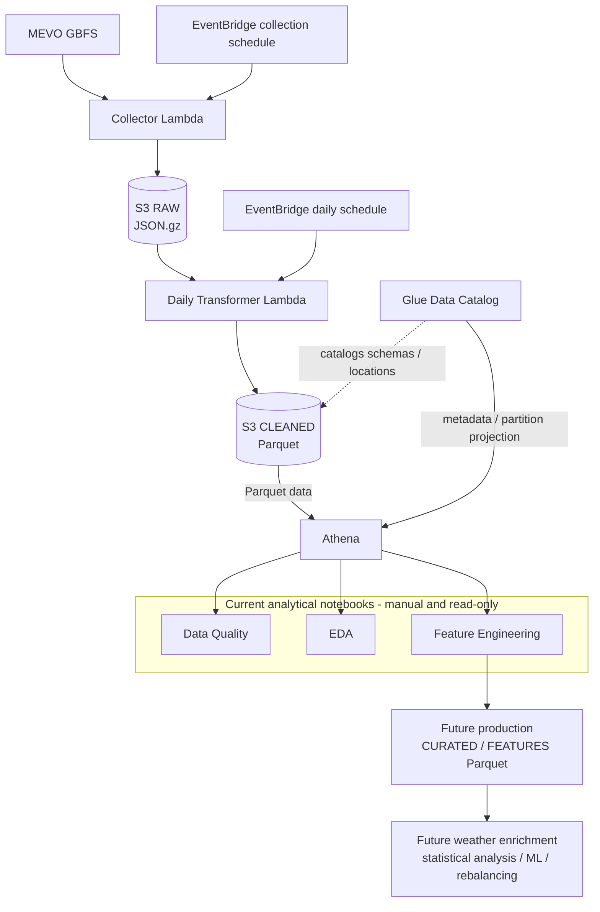

# Architecture Notes

The current architecture has three distinct boundaries:

1. an autonomous AWS production pipeline that collects GBFS snapshots and publishes CLEANED Parquet;
2. a manually executed, read-only analytical notebook layer for Data Quality, EDA, and Feature Engineering;
3. a future production feature layer that will publish the accepted feature contract for weather enrichment and ML.

RAW and CLEANED remain separate logical data layers. This preserves source evidence while allowing analytical assumptions and feature definitions to evolve without recollecting history.

## Current Architecture


```mermaid
flowchart TB
    GBFS[MEVO GBFS]
    COLLECT_SCHEDULE[EventBridge collection schedule]
    TRANSFORM_SCHEDULE[EventBridge daily schedule]
    COLLECTOR[Collector Lambda]
    RAW[(S3 RAW<br/>JSON.gz)]
    TRANSFORMER[Daily Transformer Lambda]
    CLEANED[(S3 CLEANED<br/>Parquet)]
    GLUE[Glue Data Catalog]
    ATHENA[Athena]

    subgraph ANALYTICAL[Current analytical notebooks - manual and read-only]
        DQ[Data Quality]
        EDA[EDA]
        FE[Feature Engineering]
    end

    FEATURES[Future production<br/>CURATED / FEATURES Parquet]
    FUTURE[Future weather enrichment<br/>statistical analysis / ML / rebalancing]

    GBFS --> COLLECTOR
    COLLECT_SCHEDULE --> COLLECTOR
    COLLECTOR --> RAW
    RAW --> TRANSFORMER
    TRANSFORM_SCHEDULE --> TRANSFORMER
    TRANSFORMER --> CLEANED
    CLEANED -->|Parquet data| ATHENA
    GLUE -. catalogs schemas / locations .-> CLEANED
    GLUE -->|metadata / partition projection| ATHENA
    ATHENA --> DQ
    ATHENA --> EDA
    ATHENA --> FE
    FE --> FEATURES
    FEATURES --> FUTURE
```

The two S3 nodes represent prefixes in the logical data architecture, not a requirement for separate buckets. The current implementation reads and writes both through the same configured bucket.

The collection and transformation path is designed to run autonomously. The three notebooks are analytical consumers of Athena results and are currently executed manually; they do not write to AWS. Their saved outputs are committed so the completed Sprint 2 work can be reviewed without cloud credentials.

## Ingestion Layer

The collector begins with the MEVO GBFS discovery document and resolves current feed URLs at runtime. This avoids coupling the application to publisher-managed endpoint URLs.

| Mode | Feeds | Cadence | Purpose |
|---|---|---|---|
| `dynamic` | `station_status`, `free_bike_status` | Every 10 minutes | Capture changing station and free-bike availability |
| `reference` | `station_information`, `vehicle_types` | Daily | Capture station and vehicle-type reference data |

Every invocation uses one UTC `collected_at` across its selected feeds. The client validates HTTP success, JSON structure, and the expected feed collection before a snapshot reaches storage. Expected per-feed API or validation errors are isolated: successful feeds are retained on a partial failure, while a total feed failure stores nothing and fails the invocation. Discovery, unexpected program errors, and S3 errors propagate rather than being hidden.

`system_pricing_plans` was explored during source reconnaissance but is not part of either deployed collection mode.

## RAW Storage Contract

The collector compresses the original response bytes in memory and writes them as gzip JSON:

```text
raw/{feed}/year=YYYY/month=MM/day=DD/<UTC-timestamp>.json.gz
```

Partition values and the filename timestamp are based on the UTC collection time. Metadata records the feed, collection time, and source `last_updated` value when available.

RAW is the replayable source of truth. Timestamped keys and application behavior make it append-only under the current contract; this documentation does not imply that S3 Object Lock, versioning, or another bucket-level immutability control is configured.

## Daily Transformation

EventBridge Scheduler invokes the cleaned transformer daily at `03:30 Europe/Warsaw` with `{}`. The Lambda converts its current UTC time to Warsaw time and selects the previous local calendar date. A validated `local_date` override also supports explicit reruns or backfills.

For each supported cleaned feed, the transformer:

1. computes the local day's half-open UTC interval;
2. lists the one or two UTC RAW partitions touched by that interval;
3. filters snapshots by their timestamped object keys;
4. decompresses and validates every selected snapshot;
5. normalizes records into a stable schema and deterministic order;
6. serializes one Snappy-compressed Parquet file;
7. writes the deterministic local-date output key.

The current cleaned feeds run sequentially: `station_status` first, then `station_information`. Publication is not a transactional two-dataset commit. If the second feed fails after the first was written, rerunning the same local date safely replaces the derived daily objects from preserved RAW data.

## Local-Day and UTC Contract

Time semantics are explicit because a mobility "day" and an object-storage partition do not use the same boundary.

| Item | Contract |
|---|---|
| RAW partition date | UTC date of collection |
| Batch date | `Europe/Warsaw` calendar date |
| Batch window | Half-open interval from local midnight to the next local midnight, converted to UTC |
| CLEANED partition date | Warsaw local calendar date |
| Parquet timestamps | UTC with millisecond precision |

The implementation uses `ZoneInfo("Europe/Warsaw")` and converts both midnight boundaries independently. It does not hard-code UTC+1 or UTC+2, so spring and autumn daylight-saving transitions produce the correct 23- and 25-hour windows. A normal Warsaw day also commonly crosses two UTC partition dates.

`snapshot_ts` comes from the collector timestamp encoded in the RAW object key. Source timestamps such as `feed_last_updated` and `last_reported` remain separate fields. PyArrow writes all analytical timestamps at millisecond precision for Athena Engine v3 compatibility.

## CLEANED Parquet Layer

| Source feed | Dataset | Grain | Output |
|---|---|---|---|
| `station_status` | `fact_station_status` | Station × dynamic snapshot | `cleaned/fact_station_status/year=YYYY/month=MM/day=DD/part-000.parquet` |
| `station_information` | `dim_station` | Station × reference snapshot | `cleaned/dim_station/year=YYYY/month=MM/day=DD/part-000.parquet` |

Schemas are explicit and non-nullable except for the optional `address` and `cross_street` dimension fields. Validation rejects malformed required fields, duplicate station IDs within one source snapshot, invalid coordinates or counters, and inconsistent known vehicle totals. Non-breaking source metadata deviations are retained as warnings rather than silently changing the schema.

`free_bike_status` and `vehicle_types` remain available in RAW but do not yet have cleaned datasets.

## Glue and Athena Serving Layer

The `mevo_analytics` Glue database describes two external tables, `fact_station_status` and `dim_station`. Glue stores schemas, partition-projection properties, and S3 locations; it does not hold the underlying rows. Athena reads the Parquet files directly from S3.

Partition projection calculates `year`, `month`, and `day` locations at query time, avoiding a crawler or daily `ADD PARTITION` operation. A validated query joined the two datasets by `station_id` and matching local-date partition values.

The dimension's actual grain is station × reference snapshot, not an enforced single row per station per day. The deployed daily reference cadence normally yields one snapshot. If more are present, consumers should select the intended `snapshot_ts` before a many-to-one fact/dimension join.

The repository currently contains the producer implementation and Parquet contracts, but no tracked Glue/Athena DDL or infrastructure-as-code. Those AWS resources were configured and verified separately.

## Analytical Notebook Layer

Sprint 2 uses Athena as the server-side analytical engine and Pandas as a compact result-consumption layer:

- Athena performs partition-pruned scans, aggregations, joins, and window functions over CLEANED Parquet.
- Pandas receives small analytical results, station-level summaries, diagnostics, and feature availability tables rather than the full fact table.
- `01_data_quality_and_baseline.ipynb` validates cadence, coverage, duplicates, NULLs, logic/ranges, and scheduler-aware freshness.
- `02_eda.ipynb` describes temporal, station-level, composition, and geospatial patterns while keeping availability separate from demand claims.
- `03_feature_engineering.ipynb` defines cadence-safe deltas, flow/activity proxies, validated lags, rolling features, and cyclical time encodings.

The notebooks remain read-only with respect to AWS. Their outputs are intentionally committed for portfolio review. The accepted feature contract is not yet a production table; it is the input to the next architecture step.

## Next Architecture Step

The next production path is documented here but is not implemented in the current sprint:

```text
CLEANED
  -> production feature transformation
  -> S3 CURATED / FEATURES Parquet
  -> Athena feature table
```

The production transformation should carry forward the reviewed cadence and leakage rules from the notebook, publish a stable feature schema, and add a validation/quality contract. Weather enrichment, statistical analysis, and ML forecasting should consume that feature table later rather than writing back into the analytical notebooks.

## Why This Stack Is Sufficient

- **S3** provides durable, low-cost storage for immutable-style RAW history and compact analytical files.
- **Lambda** fits short collection jobs and a daily transformation that has already completed in roughly 10 seconds at the validated volume.
- **EventBridge Scheduler** expresses three simple time-based triggers without a continuously running orchestrator.
- **Glue and Athena** provide schema-on-read SQL without loading the data into another database.
- **Daily compaction** turns many small snapshots into one scan-efficient object per dataset and local date.

This keeps operational surface area proportional to the project while preserving clear seams for production feature growth.

## Why Heavier Platforms Are Deferred

| Technology | Why it is not used yet |
|---|---|
| Spark | The current daily volume fits comfortably in one Lambda process; distributed execution would add packaging and operational cost without a measured need |
| Airflow | Three fixed schedules and one linear batch do not yet require a separate workflow platform or metadata database |
| Redshift | Athena already answers analytical SQL directly over compact Parquet, so a provisioned warehouse would duplicate storage and loading work |
| RDS | The pipeline has no transactional application workload or mutable relational state |

These technologies are not rejected permanently. They become reasonable when data volume, dependency graphs, latency, concurrency, or educational goals create a concrete requirement.

## Future Production and ML Layer

The future work is intentionally separated from the current analytical notebooks:

1. production CURATED / FEATURES Parquet and an Athena feature table;
2. historical weather enrichment and statistical analysis;
3. an explainable availability forecasting baseline;
4. empty/full risk analysis and rebalancing recommendations;
5. an optional compact presentation layer.

The RAW/CLEANED boundary and explicit time contract allow these steps to evolve without changing ingestion or losing source history.
